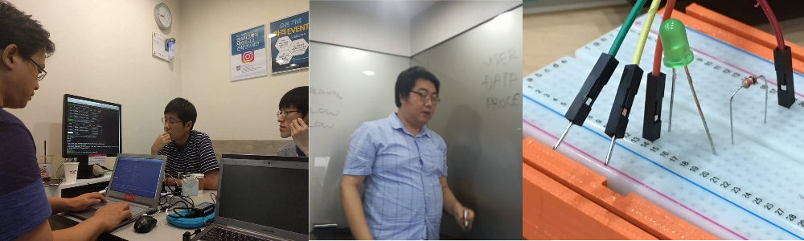

# 그룹 스터디

주기적으로 우분투 또는 우분투 관련 오픈소스 기술에 대해 주제를 선정하여 그룹 스터디를 진행하고 있습니다. 
스터디에 필요한 비용이나 공간, 장비 등은 되도록이면 커뮤니티 차원에서 지원하거나 별도 후원을 받아 진행하고 있습니다.

컨테이너, 리눅스 데스크탑 앱 개발, 서버 구축 등 다양한 주제로 스터디를 진행하고 있습니다.

스터디 주제는 회원이 제안 하거나, 운영진 측에서 기획하여 선정하며, 스터디 구성원 모집 시 포럼이나 소셜 미디어 채널 등을 통해 모집합니다.
그룹 스터디 산출물은 위키 또는 GitHub 등에 공유되고 있습니다.

- [진행 중이거나 과거 진행된 그룹 스터디 보기](https://wiki.ubuntu-kr.org/index.php/%EC%9A%B0%EB%B6%84%ED%88%AC_%ED%95%9C%EA%B5%AD_%EC%BB%A4%EB%AE%A4%EB%8B%88%ED%8B%B0_%EC%8A%A4%ED%84%B0%EB%94%94_%EB%AA%A9%EB%A1%9D)
- [GitHub Organization 보기](https://github.com/ubuntu-kr)
# 프로젝트

우분투 또는 관련 오픈소스 기술에 대한 오픈소스 프로젝트에 참여하거나, 새로운 프로젝트를 개발하고 있습니다.
마찬가지로 프로젝트 참여 또는 개발에 필요한 리소스를 뮤니티 차원에서 지원하거나 별도 후원을 받아 진행하고 있습니다.

리눅스 데스크탑 개발, 임베디드 개발, 입력기 연구 및 개발 등 다양한 주제로 프로젝트를 진행하고 있습니다.

프로젝트 또한 산출물이 위키 또는 GitHub 등을 통해 공유되고 있습니다.

- [진행 중이거나 과거 진행된 프로젝트 보기](https://wiki.ubuntu-kr.org/index.php/%EC%9A%B0%EB%B6%84%ED%88%AC_%ED%95%9C%EA%B5%AD_%EC%BB%A4%EB%AE%A4%EB%8B%88%ED%8B%B0_%ED%94%84%EB%A1%9C%EC%A0%9D%ED%8A%B8_%EB%AA%A9%EB%A1%9D)
- [GitHub Organization 보기](https://github.com/ubuntu-kr)